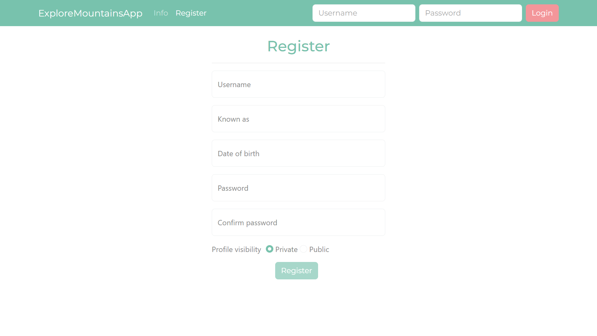
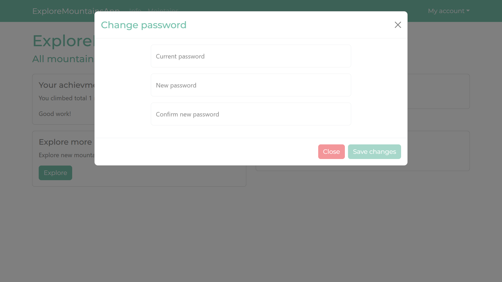
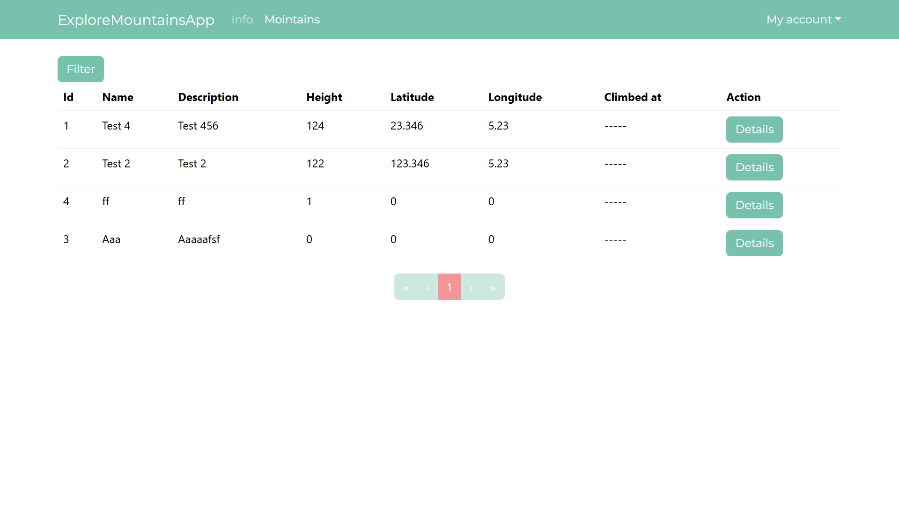
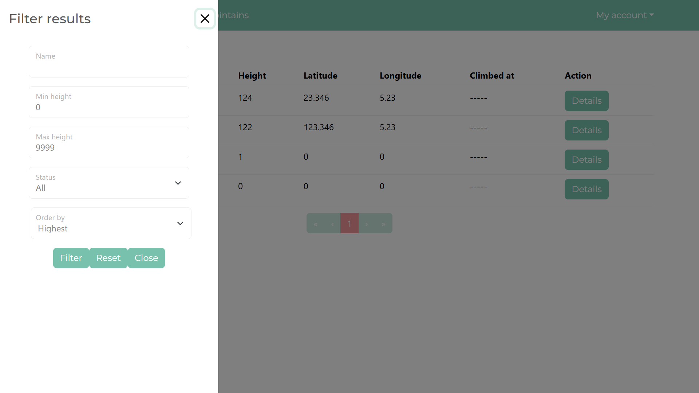
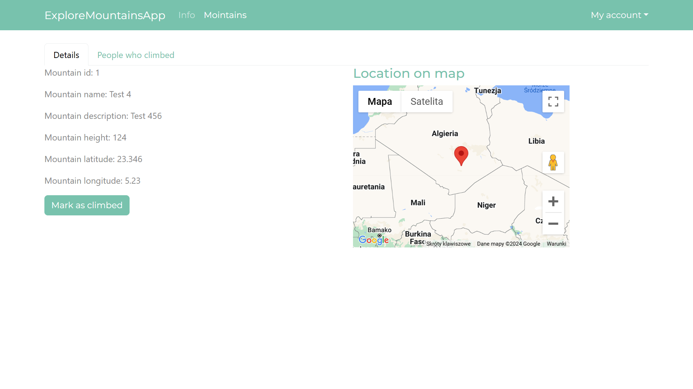
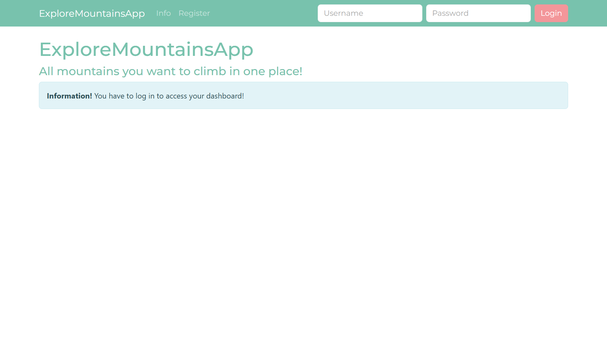
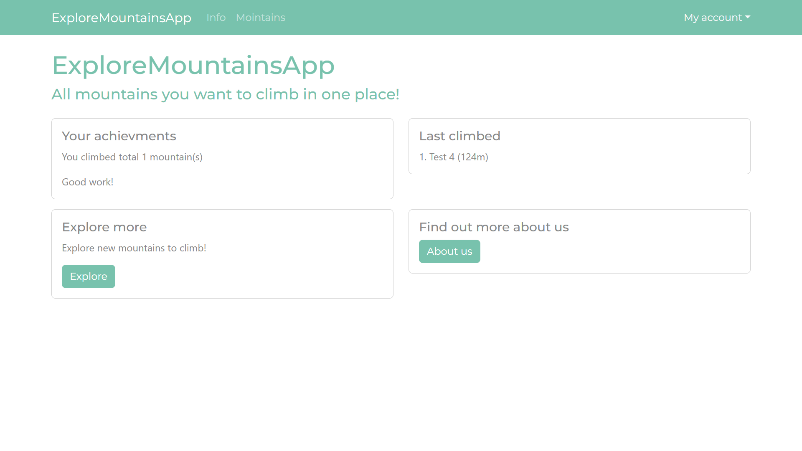

# Explore mountainApp

ExploreMountainsApp is application written with a goal to learn, understand and implement Google API to display locations on map.

## Demo

Images showing app functionalities listed below

Register view

Change password view

Mountains listed view

Mountains filtering view

Mountains detail view

Home page view

Home page authenticated view

